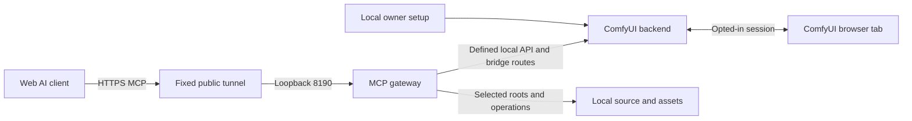

# MCP architecture and ownership

The MCP implementation stays inside the existing Arkennemasis custom-node pack. The pack loader registers the lightweight ComfyUI bridge independently of its other node modules. Optional gateway imports and dependencies remain separate. Setup creates only `run_nvidia_gpu_fast_fp16_accumulation_with_mcp.bat` from the recognized fast-FP16 portable launcher. All originals call ComfyUI directly and are changed only to remove an earlier Arkennemasis auto-start hook from a recognized CPU, standard GPU or fast-FP16 original, with a private backup. Unrecognized/custom companion files are not overwritten. ComfyUI's core files are not rewritten.

## Module map

| Location | Responsibility |
| --- | --- |
| `mcp_service/settings.py` | Installation config, path validation, capability defaults and credentials |
| `mcp_service/server.py`, `auth.py` | MCP transport, token verification, host protection and service lifecycle |
| `mcp_service/tools*.py` | Tool schemas, annotations, capability enforcement and calls into domain modules |
| `mcp_service/client.py`, `assets.py` | Defined local ComfyUI API calls, output descriptors and image transfer |
| `mcp_service/workflows.py` | Confined saved JSON, revisions, patches and snapshots |
| `mcp_service/canvas_edits.py`, `execution.py` | Persisted canvas request identity and generation ledger |
| `mcp_service/operations.py` | Bounded background work and durable operation status |
| `mcp_service/development.py`, `node_tests.py` | Selected source files, backups, scaffold/static validation and explicit unittest execution |
| `mcp_service/maintenance.py` | Defined Git operations and reviewed exact-version wheel installation |
| `mcp_service/media.py` | Scoped inventory, metadata, previews, asset trash and checked model downloads |
| `mcp_service/comfy_bridge.py`, `comfy_events.py` | Local control routes, browser broker, runtime/restart and bounded execution observations |
| `mcp_service/companion.py`, `tunnel.py` | Owned gateway/tunnel startup, readiness, recovery and cleanup |
| `mcp_service/launch_config.py`, `launch_backend.py`, `backend_worker.py` | Validated launch overrides, stable BAT-owned supervisor and fixed backend worker |
| `mcp_service/installation.py`, `setup_routes.py` | Owner-initiated setup, runtime installation and portable launcher integration |
| `web/mcp/bridge.js`, `setup.js` | Sharing, canvas revisions/apply/undo, connection badge and local owner setup |
| `tests/mcp/` | Domain, transport, auth, lifecycle, frontend and opt-in live checks |

See [OAuth](oauth.md) for the authentication configuration and client-access management modules.

## Processes and data flow

The gateway uses stdio for trusted local clients or Streamable HTTP for HTTP clients/tunnels. Its optional packages are loaded by `launch.py` from `.runtime/pyXY`, falling back to the legacy `.runtime` directory. Setup validates the chosen interpreter and installs gateway packages into this separate target. This isolates dependency installation; it does not create a security boundary around Python code.

ComfyUI's actual interpreter is recorded separately for package inspection, installation and node tests. Gateway Python and ComfyUI Python can therefore differ. Importing the pack does not start the gateway, install dependencies or expose a public connection.

The Windows companion is started by the with-MCP BAT and retains a process handle to that owner and a singleton lock. It owns only the gateway and foreground Funnel it starts. An existing gateway or HTTPS mapping is not overwritten. Closing that BAT ends its owned connection; the Tailscale base service remains available for other uses. The ordinary BAT neither starts the companion nor terminates a separately running manual connection.

The managed backend launcher stays attached to the with-MCP BAT while a fixed worker runs ComfyUI. It starts a replacement worker only after a matching authenticated restart record and exit status, subject to a restart budget. Normal crashes remain stopped for diagnosis. This preserves process ownership across Windows restarts; unmanaged sessions must first be relaunched through the with-MCP BAT. Only this managed path applies saved MCP launch overrides. The original BAT preserves its direct ComfyUI command and flags.

Temporary health failures are tracked per layer. The companion retries gateway/tunnel failures independently with a grace period and bounded recovery budget. Backend failure is reported separately and leaves gateway diagnostics available while the owner exists. Local health and public route health are different observations. A successful public probe from this computer does not prove connectivity from an AI provider.

For alternative deployments, `web` with a saved fixed origin starts a gateway for an externally managed tunnel. With no fixed origin, it can create an optional temporary Quick Tunnel using `cloudflared`. These manual launch paths must not run alongside a companion owning the same port. A manual deployment supplies its own process supervision.

## Trust boundaries

1. Local stdio is trusted local process access. Local HTTP uses its installation bearer token.
2. Private-link mode checks the secret path before MCP routing. A complete URL grants the enabled installation scopes; `/mcp` alone is not the public private-link endpoint.
3. OAuth validates configured issuer, signature, audience, expiry, allowed subject and scopes. See [OAuth configuration and revocation](oauth.md) for the provider and gateway responsibilities.
4. Gateway-to-ComfyUI bridge calls use a separate loopback installation secret. The public gateway is not an arbitrary ComfyUI route proxy.
5. Browser sharing routes use origin, host and custom-header checks. A shared page has its own session identity and secret. Remote MCP callers cannot use the local owner setup routes through the gateway.
6. Installation-enabled scopes are checked at tool execution. Development additionally needs an owner-selected pack. No general shell, arbitrary interpreter flags or arbitrary filesystem tool is exposed.

Source restrictions reject traversal, links/junctions/hard links and protected files. They do not sandbox executed code at OS level. Custom nodes, dependencies and node tests execute with ComfyUI's permissions. Other installed local custom nodes are part of that trusted runtime and can register their own routes; this gateway does not provide a security guarantee for unrelated node packs.

## State and retry semantics

Private installation state lives under `mcp_service/.local/`: config and connection credentials, launcher paths, lifecycle status, diagnostic logs, source/workflow snapshots, asset trash manifests, package plans and approval records, and SQLite request/operation ledgers. `.local/` and `.runtime/` are ignored by Git. Do not copy them into an example configuration or release archive.

A saved workflow revision is a content hash. A live canvas revision belongs to its browser workflow identity. They are not interchangeable. The frontend serializes UI JSON and derives API prompt JSON; saving a file does not apply it to the browser.

Canvas sharing defaults off for every page load. Live sockets preserve sessions despite background timer throttling; disconnected sessions have a grace period. Explicit revocation remains effective across reconnect attempts. An edit targets one session and revision. The frontend acknowledges an applied change and keeps bounded undo history; an edit never implicitly queues generation.

A prepared canvas mutation is persisted before dispatch. Reusing a request UUID must preserve target, revision and arguments. Generation submissions use a separate durable ledger. Maintenance/media operations return pollable records instead of holding a web request open for long work. An interrupted or uncertain operation is not silently replayed; the client must inspect status and the actual target.

## Extending the implementation

Keep public tool definitions in the matching `tools_*` module and behavior in its domain module. Every tool declares a capability and accurate read/write/open-world annotations. Check destination boundaries before mutation, keep responses bounded, and distinguish requested, applied and confirmed outcomes.

Use exact-target operations instead of adding a generic shell or API proxy. Add tests for changed boundaries and retry behavior. Verify state changes through MCP transport and real frontend acknowledgments before claiming a new integration is ready.
